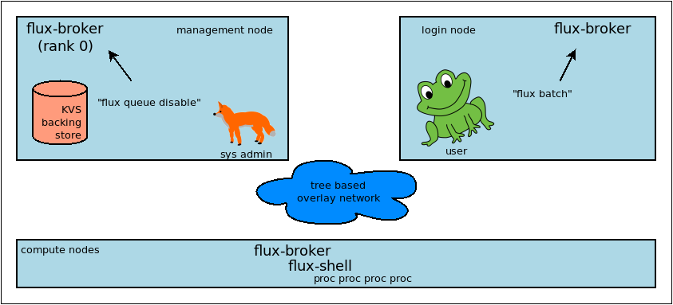

.. _admin-guide:

##########################
Flux Administrator's Guide
##########################

The *Flux Administrator's Guide* documents relevant information for
installation, configuration, and management of Flux as the native
resource manager on a cluster.

.. note::
    Flux is still beta software and many of the interfaces documented
    in this guide may change with regularity.

.. warning::
    The Flux system instance is primarily tested on a 128 node cluster.

***********************
Overview and Background
***********************

:doc:`start` and :doc:`interact` provide recipes for starting Flux and
navigating a hierarchy of Flux instance that do not require administrator
privilege or configuration.  It may be helpful to develop some perspective
on Flux in these contexts before configuring a Flux system instance.

Flux Architecture
=================

A *Flux instance* consists of one or more Flux brokers communicating over a
tree-based overlay network.  Most of Flux's distributed systems and services
that aren't directly associated with a running job are embedded in the
:man1:`flux-broker` executable or its dynamically loaded plugins.

Flux may be used in *single-user mode*, where a Flux instance is launched as
a parallel job, and the *instance owner* (the user that submitted the parallel
job) has control of, and exclusive access to, the Flux instance and its
assigned resources.  On a system running Flux natively, batch jobs and
allocations are examples of single user Flux instances.

When Flux is deployed as the *system instance*, or native resource manager on
a cluster, its brokers still run with the credentials of a non-privileged
system user, typically ``flux``.  However, to support multiple users and
act as a long running service, it must be configured to behave differently:

- The Flux broker is started directly by systemd on each node instead of
  being launched as a process in a parallel job.
- The systemd unit file passes arguments to the broker that tell it to use
  system paths for various files, and to ingest TOML files from a system
  configuration directory.
- A single security certificate is used for the entire cluster instead of
  each broker generating one on the fly and exchanging public keys with PMI.
- The Flux overlay network endpoints are statically configured from files
  instead of being generated on on the fly and exchanged via PMI.
- The instance owner is a system account that does not correspond to an
  actual user.
- Users other than the instance owner (*guests*) are permitted to connect
  to the Flux broker, and are granted limited access to Flux services.
- Users connect to the Flux broker's AF_UNIX socket via a well known system URI
  if FLUX_URI is not set in the environment.
- Job processes (including the Flux job shell) are launched as the submitting
  user with the assistance of a setuid root helper on each node called the IMP.
- Job requests are signed with MUNGE, and this signature is verified by the IMP.
- The content of the Flux KVS, containing system state such as the set of
  drained nodes and the job queue, is preserved across a full Flux restart.
- The system instance functions with some nodes offline.
- The system instance has no *initial program*.

The same Flux executables are used in both single user and system modes,
with operation differentiated only by configuration.

   Fox prevents Frog from submitting jobs on a cluster with Flux
   as the system resource manager.

Software Components
===================

Flux was conceived as a resource manager toolkit rather than a monolithic
project, with the idea to make components like the scheduler replaceable.
In addition, several parts of flux can be extended with plugins.  At this
time the primary component types are

broker modules
  Each broker module runs in its own thread as part of the broker executable,
  communicating with other components using messages.  Broker modules are
  dynamically loadable with the :man1:`flux-module` command.  Core
  services like the KVS, job manager, and scheduler are implemented using
  broker modules.

jobtap plugins
  The job manager orchestrates a job's life cycle.  Jobtap plugins extend the
  job manager, arranging for callbacks at different points in the job life
  cycle.  Jobtap plugins may be dynamically loaded with the
  :man1:`flux-jobtap` command.  An example of a jobtap plugin is the Flux
  accounting multi-factor priority plugin, which updates a job's priority value
  when it enters the PRIORITY state.

shell plugins
  When a job is started, the :man1:`flux-shell` is the process parent
  of job tasks on each node.  Shell plugins extend the job environment and
  can be configured on a per-job basis using the ``--setopt`` option of
  :man1:`flux-run` and related job submission commands.  ``affinity``,
  ``pmi``, and ``pty`` are examples of Flux shell plugins.

connectors
  Flux commands open a connection to a particular Flux instance by specifying
  a URI.  The *scheme* portion of the URI may refer to a *native* connection
  method such as ``local`` or ``ssh``.  Native connection methods are
  implemented as plugins called *connectors*.  See :man3:`flux_open`.

URI resolver plugins
  Other URI schemes must be *resolved* to a native form before they can be used.
  Resolvers for new schemes may be added as plugins.  For example, the ``lsf``
  resolver plugin enables LSF users to connect to Flux instances running as LSF
  jobs by specifying a ``lsf:JOBID`` URI.  See :man1:`flux-uri`.

validator plugins
  Jobs may be rejected at ingest if their jobspec fails one of a set of
  configured validator plugins.  The basic validator ensures the jobspec
  conforms to the jobspec specification.  The ``feasibility`` plugin rejects
  job that the scheduler determines would be unable to run given the instance's
  resource set.  The ``require-instance`` plugin rejects jobs that do not run
  in a new Flux instance.  See :man5:`flux-config-ingest`.

frobnicator plugins
  The frobnicator allows a set of configured plugins to modify jobspec at
  submission time.  For example the ``defaults`` plugin sets configured default
  values for jobspec attributes such as *duration* and *queue*.  See
  :man5:`flux-config-ingest`.

Independently developed Flux components are generally packaged and versioned
separately.  Each package may provide one or more of the above components
as well as man pages and :man1:`flux` subcommands.  At this stage of Flux
development, it is good practice to combine only contemporaneously released
components as the interfaces are not stable yet.

File Formats and Data Types
===========================

Since some parts of Flux are developed independently, some effort has been
made to standardize file formats and data types to ensure components work
together and provide a consistent user experience.  System administrators may
find it useful to be aware of some of them.

hostlist
  A compact way of representing an ordered list of hostnames, compatible with
  legacy tools in use at LLNL and defined by
  `RFC 29 <https://flux-framework.readthedocs.io/projects/flux-rfc/en/latest/spec_29.html>`_.

idset
  A compact way of representing an unordered set of integers, defined by
  `RFC 22 <https://flux-framework.readthedocs.io/projects/flux-rfc/en/latest/spec_22.html>`_.

TOML
  `Tom's Oblivious Minimal Language <https://github.com/toml-lang/toml>`_
  is the file format used in Flux configuration files.

JSON
  `Javascript Object Notation <https://json-spec.readthedocs.io/reference.html>`_
  is used throughout Flux in messages and other file formats.

eventlog
  An ordered log of timestamped events, stored in the Flux KVS and defined by
  `RFC 18 <https://flux-framework.readthedocs.io/projects/flux-rfc/en/latest/spec_18.html>`_.
  Eventlogs are used to record job events, capture standard I/O streams,
  and record resource status changes.

FSD
  Flux Standard Duration, a string format used to represent a length of time,
  defined by
  `RFC 23 <https://flux-framework.readthedocs.io/projects/flux-rfc/en/latest/spec_23.html>`_.

jobspec
  A job request (JSON or YAML), defined by
  `RFC 25 <https://flux-framework.readthedocs.io/projects/flux-rfc/en/latest/spec_25.html>`_ and
  `RFC 14 <https://flux-framework.readthedocs.io/projects/flux-rfc/en/latest/spec_14.html>`_.

R
  A resource set (JSON), defined by
  `RFC 20 <https://flux-framework.readthedocs.io/projects/flux-rfc/en/latest/spec_20.html>`_.

FLUID
  Flux Locally Unique ID, used for Flux job IDs, defined by
  `RFC 19 <https://flux-framework.readthedocs.io/projects/flux-rfc/en/latest/spec_19.html>`_.

Security
========

The Flux brokers that make up a system instance are started on each node by
systemd.  The brokers run as an unprivileged system user, typically ``flux``.
This user is termed the *instance owner*.  The instance owner has complete
control of the Flux instance.

A tree-based overlay network is established among brokers, rooted at the
management node.  This network is secured and encrypted using the
`ZeroMQ CURVE <https://rfc.zeromq.org/spec:25>`_ mechanism.  This requires
a single CURVE certificate to be generated and installed on all nodes,
typically ``/etc/flux/system/curve.cert``, before Flux begins operation.
The certificate must be readable by the instance owner but should be carefully
protected from access by other users since disclosure could allow overlay
network security to be bypassed.

On each node, users and tools may connect to the local system instance broker
via a UNIX domain socket at a well known location, usually ``/run/flux/local``.
Users are authenticated on this socket using the SO_PEERCRED socket option.
Once connected, a user may inject messages into the overlay network.  Messages
are stamped by the broker at ingress with the user's authenticated userid,
and a *role mask* that identifies any special capabilities granted to the user.
Messages that are sent by the ``flux`` user are stamped with the instance owner
role, while other users, or *guests*, are stamped with a role that grants
minimal access.  Note that the ``root`` user is considered a guest user with
no special privilege in Flux, but sites can choose to grant ``root`` the owner
role by configuration if desired.  See :security:man5:`flux-config-security`.

Messages are used for remote procedure calls.  A Flux service may allow or deny
an RPC request depending on its message rolemask or userid.  For example,
only the instance owner can drain a node because the drain service only allows
drain request messages that have the owner role.  Similarly, any job can be
canceled by a cancel request message with the owner role, but in addition, jobs
can be canceled by guests whose message userid matches the target job userid.

A Flux job is launched when brokers launch one :man1:`flux-shell` per
node with the credentials of the user that submitted the job.  When that is a
guest user, Flux employs a setuid helper called the :security:man8:`flux-imp`
to launch the shells with the guest credentials.  The shells in turn launch
one or more user processes that compose the parallel job.

The IMP is restricted by configuration to only allow the ``flux`` user to run
it, and to only launch the system Flux job shell executable.  In addition, job
requests are signed by the submitting user with
`MUNGE <https://github.com/dun/munge>`_, and the IMP verifies this signature
before starting the shells.  The current working directory of the job, the
environment, and the executable command line are examples of job request data
protected by the MUNGE signature.

When Flux starts a batch job or allocation, it starts an independent,
single-user Flux instance with brokers running as the submitting user.  The new
instance owner has complete control over this Flux instance, which cannot use
the IMP to launch jobs as guests, and does not permit guests to connect to
its UNIX domain sockets.  Its overlay network is also secured with the ZeroMQ
CURVE mechanism, but instead of starting with a shared certificate read from
disk, each broker generates a certificate in memory on the fly, then exchanges
public keys and socket endpoints with peer brokers using the PMI service
offered by the Flux shells of the enclosing instance.  In other words, the
single-user Flux instance bootstraps like an MPI parallel program.

See also:
`RFC 12 <https://flux-framework.readthedocs.io/projects/flux-rfc/en/latest/spec_12.html>`_,
`RFC 15 <https://flux-framework.readthedocs.io/projects/flux-rfc/en/latest/spec_15.html>`_.

************
Installation
************

System Prerequisites
====================

`MUNGE <https://github.com/dun/munge>`_ is used to sign job requests
submitted to Flux, so the MUNGE daemon should be installed on all
nodes running Flux with the same MUNGE key used across the cluster.

System clocks must be synchronized across the cluster, e.g. with
`Network Time Protocol <https://en.wikipedia.org/wiki/Network_Time_Protocol>`_.

Flux assumes a shared UID namespace across the cluster.

A system user named ``flux`` is required.  This user need not have a valid
home directory or shell.

Flux uses `hwloc <https://www.open-mpi.org/projects/hwloc/>`_ to verify that
configured resources are present on nodes.  Ensure that the system installed
version includes any plugins needed for the hardware, especially GPUs.

A Word about Core Dumps
-----------------------

It is helpful to enable core dumps from the system instance ``flux-broker``
(especially rank 0) so that useful bug reports can be filed should the broker
crash.  Usually :linux:man8:`systemd-coredump` handles this, which makes core
files and stack traces accessible with :linux:man1:`coredumpctl`.

Some sites choose instead to configure the ``kernel.core_pattern``
:linux:man8:`sysctl` parameter to a relative file path, which directs core
files to the program's current working directory.  Please note that the system
instance broker runs as the ``flux`` user with a working directory of ``/``
and thus would not have write permission on its current working directory.

.. note::
  If you do observe a ``flux-broker`` crash, please open a github issue at
  https://github.com/flux-framework/flux-core/issues and include the Flux
  version, relevant log messages from ``journalctl -u flux``, and a stack
  trace, if available.

Installing Software Packages
============================

The following Flux framework packages are needed for a Flux system instance
and should be installed from your Linux distribution package manager.

flux-security
  APIs for job signing, and the IMP, a privileged program for starting
  processes as multiple users. Install on all nodes (required).  If building
  flux-security from source, be sure to configure with ``--enable-pam`` to
  include Pluggable Authentication Modules (PAM) support.

flux-core
  All of the core components of Flux, including the Flux broker.
  flux-core is functional on its own, but cannot run jobs as multiple users,
  has a simple FIFO scheduler, and does not implement accounting-based job
  prioritization. If building flux-core from source, be sure to configure with
  ``--with-flux-security``. Install on all nodes (required).

flux-sched
  The Fluxion graph-based scheduler.

flux-accounting (optional)
  Management of limits for individual users/projects, banks, and prioritization
  based on fair-share accounting.  For more information on how to configure
  run flux-accounting, please refer to the `Flux Accounting Guide <https://flux-framework.readthedocs.io/en/latest/guides/accounting-guide.html>`_.

flux-pam (optional)
  A PAM module that can enable users to login to compute nodes that are
  running their jobs.

.. note::
    Flux packages are currently maintained only for the
    `TOSS <https://computing.llnl.gov/projects/toss-speeding-commodity-cluster-computing>`_
    Red Hat Enterprise Linux based Linux distribution, which is not publicly
    distributed.  Open an issue in `flux-core <https://github.com/flux-framework/flux-core>`_
    if you would like to become a maintainer of Flux packages for another Linux
    distribution so we can share packaging tips and avoid duplicating effort.

*************
Configuration
*************

Much of Flux configuration occurs via
`TOML <https://github.com/toml-lang/toml>`_ configuration files found in a
hierarchy under ``/etc/flux``.  There are three separate TOML configuration
spaces:  one for flux-security, one for the IMP (an independent component of
flux-security), and one for Flux running as the system instance.  Each
configuration space has a separate directory, from which all files matching
the glob ``*.toml`` are read.  System administrators have the option of using
one file for each configuration space, or breaking up each configuration space
into multiple files.  In the examples below, one file per configuration space
is used.

For more information on the three configuration spaces, please refer to
:man5:`flux-config`, :security:man5:`flux-config-security`, and
:security:man5:`flux-config-security-imp`.

Configuring flux-security
=========================

When Flux is built to support multi-user workloads, job requests are signed
using a library provided by the flux-security project.  This library reads
a static configuration from ``/etc/flux/security/conf.d/*.toml``. Note
that for security, these files and their parent directory should be owned
by ``root`` without write access to other users, so adjust permissions
accordingly.

Example file installed path: ``/etc/flux/security/conf.d/security.toml``

.. code-block:: toml

 # Job requests should be valid for 2 weeks
 # Use munge as the job request signing mechanism
 [sign]
 max-ttl = 1209600  # 2 weeks
 default-type = "munge"
 allowed-types = [ "munge" ]

See also: :security:man5:`flux-config-security-sign`.

Configuring the IMP
===================

The Independent Minister of Privilege (IMP) is the only program that runs
as root, by way of the setuid mode bit.  To enhance security, it has a
private configuration space in ``/etc/flux/imp/conf.d/*.toml``. Note that
the IMP will verify that files in this path and their parent directories
are owned by ``root`` without write access from other users, so adjust
permissions and ownership accordingly.

Example file installed path: ``/etc/flux/imp/conf.d/imp.toml``

.. code-block:: toml

 # Only allow access to the IMP exec method by the 'flux' user.
 # Only allow the installed version of flux-shell(1) to be executed.
 [exec]
 allowed-users = [ "flux" ]
 allowed-shells = [ "/usr/libexec/flux/flux-shell" ]

 # Enable the "flux" PAM stack (requires PAM configuration file)
 pam-support = true

See also: :security:man5:`flux-config-security-imp`.

Configuring the Flux PAM Stack
------------------------------

If PAM support is enabled in the IMP config, the ``flux`` PAM stack must
exist and have at least one ``auth`` and one ``session`` module.

Example file installed path: ``/etc/pam.d/flux``

.. code-block:: console

  auth    required pam_localuser.so
  session required pam_limits.so

The ``pam_limits.so`` module is useful for setting default job resource
limits.  If it is not used, jobs run in the system instance may inherit
inappropriate limits from ``flux-broker``.

.. note::
  The linux kernel employs a heuristic when assigning initial limits to
  pid 1.  For example, the max user processes and max pending signals
  are scaled by the amount of system RAM.  The Flux system broker inherits
  these limits and passes them on to jobs if PAM limits are not configured.
  This may result in rlimit warning messages similar to

  .. code-block:: console

    flux-shell[0]:  WARN: rlimit: nproc exceeds current max, raising value to hard limit

Configuring the Network Certificate
===================================

Overlay network security requires a certificate to be distributed to all nodes.
It should be readable only by the ``flux`` user.  To create a new certificate,
run :man1:`flux-keygen` as the ``flux`` user, then copy the result to
``/etc/flux/system`` since the ``flux`` user will not have write access to
this location:

.. code-block:: console

 $ sudo -u flux flux keygen /tmp/curve.cert
 $ sudo mv /tmp/curve.cert /etc/flux/system/curve.cert

Do this once and then copy the certificate to the same location on
the other nodes, preserving owner and mode.

.. note::
    The ``flux`` user only needs read access to the certificate and
    other files and directories under ``/etc/flux``. Keeping these files
    and directories non-writable by user ``flux`` adds an extra layer of
    security for the system instance configuration.

Configuring the Flux System Instance
====================================

Although the security components need to be isolated, most Flux components
share a common configuration space, which for the system instance is located
in ``/etc/flux/system/conf.d/*.toml``.  The Flux broker for the system instance
is pointed to this configuration by the systemd unit file.

Example file installed path: ``/etc/flux/system/conf.d/system.toml``

.. code-block:: toml

 # Flux needs to know the path to the IMP executable
 [exec]
 imp = "/usr/libexec/flux/flux-imp"

 # Allow users other than the instance owner (guests) to connect to Flux
 # Optionally, root may be given "owner privileges" for convenience
 [access]
 allow-guest-user = true
 allow-root-owner = true

 # Point to shared network certificate generated flux-keygen(1).
 # Define the network endpoints for Flux's tree based overlay network
 # and inform Flux of the hostnames that will start flux-broker(1).
 [bootstrap]
 curve_cert = "/etc/flux/system/curve.cert"

 default_port = 8050
 default_bind = "tcp://eth0:%p"
 default_connect = "tcp://%h:%p"

 # Rank 0 is the TBON parent of all brokers unless explicitly set with
 # parent directives.
 hosts = [
    { host = "test[1-16]" },
 ]

 # Speed up detection of crashed network peers (system default is around 20m)
 [tbon]
 tcp_user_timeout = "2m"

 # Uncomment 'norestrict' if flux broker is constrained to system cores by
 # systemd or other site policy.  This allows jobs to run on assigned cores.
 # Uncomment 'exclude' to avoid scheduling jobs on certain nodes (e.g. login,
 # management, or service nodes).
 [resource]
 #norestrict = true
 #exclude = "test[1-2]"

 [[resource.config]]
 hosts = "test[1-15]"
 cores = "0-7"
 gpus = "0"

 [[resource.config]]
 hosts = "test16"
 cores = "0-63"
 gpus = "0-1"
 properties = ["fatnode"]

 # Store the kvs root hash in sqlite periodically in case of broker crash.
 # Recommend offline KVS garbage collection when commit threshold is reached.
 [kvs]
 checkpoint-period = "30m"
 gc-threshold = 100000

 # Immediately reject jobs with invalid jobspec or unsatisfiable resources
 [ingest.validator]
 plugins = [ "jobspec", "feasibility" ]

 # Remove inactive jobs from the KVS after one week.
 [job-manager]
 inactive-age-limit = "7d"

 # Jobs submitted without duration get a very short one
 [policy.jobspec.defaults.system]
 duration = "1m"

 # Jobs that explicitly request more than the following limits are rejected
 [policy.limits]
 duration = "2h"
 job-size.max.nnodes = 8
 job-size.max.ncores = 32

 # Configure the flux-sched (fluxion) scheduler policies
 # The 'lonodex' match policy selects node-exclusive scheduling, and can be
 # commented out if jobs may share nodes.
 [sched-fluxion-qmanager]
 queue-policy = "easy"
 [sched-fluxion-resource]
 match-policy = "lonodex"
 match-format = "rv1_nosched"

See also: :man5:`flux-config-exec`, :man5:`flux-config-access`
:man5:`flux-config-bootstrap`, :man5:`flux-config-tbon`,
:man5:`flux-config-resource`, :man5:`flux-config-ingest`,
:man5:`flux-config-archive`, :man5:`flux-config-job-manager`,
:man5:`flux-config-policy`, :man5:`flux-config-kvs`,
:sched:man5:`flux-config-sched-fluxion-qmanager`,
:sched:man5:`flux-config-sched-fluxion-resource`.

Configuring Resources
=====================

The Flux system instance must be configured with a static resource set.
The ``resource.config`` TOML array in the example above is the preferred
way to configure clusters with a resource set consisting of only nodes,
cores, and GPUs.

More complex resource sets may be represented by generating a file in
RFC 20 (R version 1) form with scheduler extensions using a combination of
``flux R encode`` and ``flux ion-R encode`` and then configuring
``resource.path`` to its fully-qualified file path.  The details of this
method are beyond the scope of this document.

When Flux is running, ``flux resource list`` shows the configured resource
set and any resource properties.

Persistent Storage on Rank 0
============================

Flux is prolific in its use of disk space to back up its key value store,
proportional to the number of jobs run and the quantity of standard I/O.
On your rank 0 node, ensure that the ``statedir`` directory (normally
``/var/lib/flux``) has plenty of space and is preserved across Flux instance
restarts.

The ``statedir`` directory is used for the ``content.sqlite`` file that
contains content addressable storage backing the Flux key value store (KVS).
The ``job-archive.sqlite`` file is also located there, if job archival is
enabled.

Adding Job Prolog/Epilog Scripts
================================

Flux does not currently support a traditional job prolog/epilog
which runs as root on the nodes assigned to a job before/after job
execution. Flux does, however, support a job-manager prolog/epilog,
which is run at the same point on rank 0 as the instance
owner (typically user ``flux``), instead of user root.

As a temporary solution, a convenience command ``flux perilog-run``
is provided which can simulate a job prolog and epilog by executing a
command across the broker ranks assigned to a job from the job-manager
prolog and epilog.

When using ``flux perilog-run`` to execute job prolog and epilog, the
job-manager prolog/epilog feature is being used to execute a privileged
prolog/epilog across the nodes/ranks assigned to a job, via the
flux-security IMP "run" command support. Therefore, each of these
components need to be configured, which is explained in the steps below.

 1. Configure the IMP such that it will allow the system instance user
    to execute a prolog and epilog script or command as root.

    .. code-block:: toml

       [run.prolog]
       allowed-users = [ "flux" ]
       path = "/etc/flux/system/prolog"

       [run.epilog]
       allowed-users = [ "flux" ]
       path = "/etc/flux/system/epilog"

    By default, the IMP will set the environment variables
    ``FLUX_OWNER_USERID``, ``FLUX_JOB_USERID``, ``FLUX_JOB_ID``, ``HOME``
    and ``USER`` for the prolog and epilog processes. ``PATH`` will
    be set explicitly to ``/usr/sbin:/usr/bin:/sbin:/bin``. To allow extra
    environment variables to be passed from the enclosing environment,
    use the ``allowed-environment`` key, which is an array of ``glob(7)``
    patterns for acceptable environment variables, e.g.

    .. code-block:: toml

       [run.prolog]
       allowed-environment = [ "FLUX_*" ]

    will pass all ``FLUX_`` environment variables to the IMP ``run``
    commands.

 2. Configure the Flux system instance to load the job-manager ``perilog.so``
    plugin, which is not active by default. This plugin enables job-manager
    prolog/epilog support in the instance:

    .. code-block:: toml

       [job-manager]
       plugins = [
         { load = "perilog.so" }
       ]

 3. Configure the Flux system instance ``[job-manager.prolog]`` and
    ``[job-manager.epilog]`` to execute ``flux perilog-run`` with appropriate
    arguments to execute ``flux-imp run prolog`` and ``flux-imp run epilog``
    across the ranks assigned to a job:

    .. code-block:: toml

       [job-manager.prolog]
       command = [
          "flux", "perilog-run", "prolog",
          "-e", "/usr/libexec/flux/flux-imp,run,prolog"
       ]
       [job-manager.epilog]
       command = [
          "flux", "perilog-run", "epilog",
          "-e", "/usr/libexec/flux/flux-imp,run,epilog"
       ]

 4. (optional) If log messages from the prolog or epilog are filling
    up the broker logs, a list of ignore patterns may be added via
    the ``[job-manager.perilog]`` ``log-ignore`` array. Each entry
    in the array should be a :linux:man7:`regex`. POSIX extended
    regular expression syntax is supported, e.g.:

    .. code-block:: toml

      [job-manager]
      perilog.log-ignore = [ ".*Xauth.*", "^foo:.*debug" ]

Note that the ``flux perilog-run`` command will additionally execute any
scripts in ``/etc/flux/system/{prolog,epilog}.d`` on rank 0 by default as
part of the job-manager prolog/epilog. Only place scripts here if there is
a need to execute scripts as the instance owner (user `flux`) on a single
rank for each job. If only traditional prolog/epilog support is required,
these directories can be ignored and should be empty or nonexistent.
To run scripts from a different directory, use the ``-d, --exec-directory``
option in the configured ``command``.

See also: :man5:`flux-config-job-manager`,
:security:man5:`flux-config-security-imp`.

Adding Job Request Validation
=============================

Jobs are submitted to Flux via a job-ingest service. This service
validates all jobs before they are assigned a jobid and announced to
the job manager. By default, only basic validation is done, but the
validator supports plugins so that job ingest validation is configurable.

The list of available plugins can be queried via
``flux job-validator --list-plugins``. The current list of plugins
distributed with Flux is shown below:

.. code-block:: console

  $ flux job-validator --list-plugins
  Available plugins:
  feasibility           Use sched.feasibility RPC to validate job
  jobspec               Python bindings based jobspec validator
  require-instance      Require that all jobs are new instances of Flux
  schema                Validate jobspec using jsonschema

Only the ``jobspec`` plugin is enabled by default.

In a system instance, it may be useful to also enable the ``feasibility`` and
``require-instance`` validators.  This can be done by configuring the Flux
system instance via the ``ingest`` TOML table, as shown in the example below:

.. code-block:: toml

  [ingest.validator]
  plugins = [ "jobspec", "feasibility", "require-instance" ]

The ``feasibility`` plugin will allow the scheduler to reject jobs that
are not feasible given the current resource configuration. Otherwise, these
jobs are enqueued, but will have a job exception raised once the job is
considered for scheduling.

The ``require-instance`` plugin rejects jobs that do not start another
instance of Flux. That is, jobs are required to be submitted via tools
like :man1:`flux-batch` and :man1:`flux-alloc`, or the equivalent.
For example, with this plugin enabled, a user running :man1:`flux-run`
will have their job rejected with the message:

.. code-block:: console

  $ flux run -n 1000 myapp
  flux-run: ERROR: [Errno 22] Direct job submission is disabled for this instance. Please use the flux-batch(1) or flux-alloc(1) commands.

See also: :man5:`flux-config-ingest`.

Adding Queues
=============

It may be useful to configure a Flux system instance with multiple queues.
Each queue should be associated with a non-overlapping resource subset,
identified by property name. It is good practice for queues to create a
new property that has the same name as the queue. (There is no requirement
that queue properties match the queue name, but this will cause extra entries
in the PROPERTIES column for these queues. When queue names match property
names, :command:`flux resource list` suppresses these matching properties
in its output.)

When queues are defined, all jobs must specify a queue at submission time.
If that is inconvenient, then ``policy.jobspec.defaults.system.queue`` may
define a default queue.

Finally, queues can override the ``[policy]`` table on a per queue basis.
This is useful for setting queue-specific limits.

Here is an example that puts these concepts together:

.. code-block:: toml

 [policy]
 jobspec.defaults.system.duration = "1m"
 jobspec.defaults.system.queue = "debug"

 [[resource.config]]
 hosts = "test[1-4]"
 properties = ["debug"]

 [[resource.config]]
 hosts = "test[5-16]"
 properties = ["batch"]

 [queues.debug]
 requires = ["debug"]
 policy.limits.duration = "30m"

 [queues.batch]
 requires = ["batch"]
 policy.limits.duration = "4h"

When named queues are configured, :man1:`flux-queue` may be used to
list them:

.. code-block:: console

 $ flux queue status
 batch: Job submission is enabled
 debug: Job submission is enabled
 Scheduling is enabled

See also: :man5:`flux-config-policy`, :man5:`flux-config-queues`,
:man5:`flux-config-resource`, :man1:`flux-queue`.

Policy Limits
=============

Job duration and size are unlimited by default, or limited by the scheduler
feasibility check discussed above, if configured.  When policy limits are
configured, the job request is compared against them *after* any configured
jobspec defaults are set, and *before* the scheduler feasibility check.
If the job would exceed a duration or job size policy limit, the job submission
is rejected.

.. warning::
  flux-sched 0.25.0 limitation: jobs that specify nodes but not cores may
  escape flux-core's ``ncores`` policy limit, and jobs that specify cores but
  not nodes may escape the ``nnodes`` policy limit.  The flux-sched feasibility
  check will eventually cover this case.  Until then, be sure to set both
  ``nnodes`` *and* ``ncores`` limits when configuring job size policy limits.

Limits are global when set in the top level ``[policy]`` table.  Global limits
may be overridden by a ``policy`` table within a ``[queues]`` entry.  Here is
an example which implements duration and job size limits for two queues:

.. code-block:: toml

 # Global defaults
 [policy]
 jobspec.defaults.system.duration = "1m"
 jobspec.defaults.system.queue = "debug"

 [queues.debug]
 requires = ["debug"]
 policy.limits.duration = "30m"
 policy.limits.job-size.max.nnodes = 2
 policy.limits.job-size.max.ncores = 16

 [queues.batch]
 requires = ["batch"]
 policy.limits.duration = "8h"
 policy.limits.job-size.max.nnodes = 16
 policy.limits.job-size.max.ncores = 128

See also: :man5:`flux-config-policy`.

Use PAM to Restrict Access to Compute Nodes
===========================================

If Pluggable Authentication Modules (PAM) are in use within a cluster, it may
be convenient to use the ``pam_flux.so`` *account* module to configure a PAM
stack that denies users access to compute nodes unless they have a job running
there.

Install the ``flux-pam`` package to make the ``pam_flux.so`` module available
to be added to one or more PAM stacks, e.g.

.. code-block:: console

  account  sufficient pam_flux.so

*************************
Day to day administration
*************************

Starting Flux
=============

Systemd may be configured to start Flux automatically at boot time,
as long as the network that carries its overlay network will be
available at that time.  Alternatively, Flux may be started manually, e.g.

.. code-block:: console

 $ sudo pdsh -w fluke[3,108,6-103] sudo systemctl start flux

Flux brokers may be started in any order, but they won't come online
until their parent in the tree based overlay network is available.

If Flux was not shut down properly, for example if the rank 0 broker
crashed or was killed, then Flux starts in a safe mode with job submission
and scheduling disabled.  :man1:`flux-uptime` shows the general state
of Flux, and :man1:`flux-startlog` prints a record of Flux starts and
stops, including any crashes.

Stopping Flux
=============

The full Flux system instance may be temporarily stopped by running
the following on the rank 0 node:

.. code-block:: console

 $ sudo flux shutdown

This kills any running jobs, but preserves job history and the queue of
jobs that have been submitted but have not yet allocated resources.
This state is held in the ``content.sqlite`` that was configured above.
See also :man1:`flux-shutdown`.

.. note::
    ``flux-shutdown --gc`` should be used from time to time to perform offline
    KVS garbage collection.  This, in conjunction with configuring inactive
    job purging, keeps the size of the ``content.sqlite`` database in check
    and improves Flux startup time.

The brokers on other nodes will automatically shut down in response,
then respawn, awaiting the return of the rank 0 broker.

To shut down a single node running Flux, simply run

.. code-block:: console

 $ sudo systemctl stop flux

on that node.

Configuration update
====================

After changing flux broker or module specific configuration in the TOML
files under ``/etc/flux``, the configuration may be reloaded with

.. code-block:: console

 $ sudo systemctl reload flux

on each rank where the configuration needs to be updated. The broker will
reread all configuration files and notify modules that configuration has
been updated.

Configuration which applies to the ``flux-imp`` or job shell will be reread
at the time of the next job execution, since these components are executed
at job launch.

.. warning::
    Many configuration changes have no effect until the Flux broker restarts.
    This should be assumed unless otherwise noted.  See :man5:`flux-config`
    for more information.

Viewing resource status
=======================

Flux offers two different utilities to query the current resource state.

``flux resource status`` is an administrative command which lists ranks
which are available, online, offline, excluded, or drained along with
their corresponding node names. By default, sets which have 0 members
are not displayed, e.g.

.. code-block:: console

 $ flux resource status
      STATE UP NNODES NODELIST
      avail  ✔     78 fluke[6-16,19-23,25-60,62-63,68,71-73,77-78,80,82-86,88,90-91,93,95-101,103]
     avail*  ✗      6 fluke[17,24,61,79,92,102]
    exclude  ✔      3 fluke[1,3,108]
    drained  ✔     13 fluke[18,64-65,67,69-70,74-76,81,87,89,94]
   drained*  ✗      1 fluke66

To list a set of states explicitly, use the ``--states`` option:
(Run ``--states=help`` to get a list of valid states)

.. code-block:: console

 $ flux resource status --states=drained,exclude
     STATE UP NNODES NODELIST
   exclude  ✔      3 fluke[1,3,108]
   drained  ✔     13 fluke[18,64-65,67,69-70,74-76,81,87,89,94]
  drained*  ✗      1 fluke66

This option is useful to get a list of ranks or hostnames in a given
state. For example, the following command fetches the hostlist
for all resources configured in a Flux instance:

.. code-block:: console

 $ flux resource status -s all -no {nodelist}
 fluke[1,3,6-103,108]

In contrast to ``flux resource status``, the ``flux resource list``
command lists the *scheduler*'s view of available resources. This
command shows the free, allocated, and unavailable (down) resources,
and includes nodes, cores, and gpus at this time:

.. code-block:: console

 $ flux resource list
     STATE QUEUE      PROPERTIES NNODES   NCORES NODELIST
      free batch                     71      284 fluke[6-16,19-23,25-60,62-63,68,71-73,77-78,80,82-86,88,90-91,93,95]
      free debug                      6       24 fluke[96-101]
      free debug      testprop        1        4 fluke103
 allocated                            0        0 
      down batch                     19       76 fluke[17-18,24,61,64-67,69-70,74-76,79,81,87,89,92,94]
      down debug      testprop        1        4 fluke102

With ``--o rlist``, ``flux resource list`` will show a finer grained list
of resources in each state, instead of a nodelist:

.. code-block:: console

 $ flux resource list -o rlist
     STATE QUEUE    PROPERTIES NNODES   NCORES    NGPUS LIST
      free batch                   71      284        0 rank[3-13,16-20,22-57,59-60,65,68-70,74-75,77,79-83,85,87-88,90,92]/core[0-3]
      free debug                    6       24        0 rank[93-98]/core[0-3]
      free debug    testprop        1        4        0 rank100/core[0-3]
 allocated                          0        0        0
      down batch                   19       76        0 rank[14-15,21,58,61-64,66-67,71-73,76,78,84,86,89,91]/core[0-3]
      down debug    testprop        1        4        0 rank99/core[0-3]

Draining resources
==================

Resources may be temporarily removed from scheduling via the
``flux resource drain`` command. Currently, resources may only be drained
at the granularity of a node, represented by its hostname or broker rank,
for example:

.. code-block:: console

 $ sudo flux resource drain fluke7 node is fubar
 $ sudo flux resource drain
 TIMESTAMP            STATE    RANK     REASON                         NODELIST
 2020-12-16T09:00:25  draining 2        node is fubar                  fluke7

Any work running on the "draining" node is allowed to complete normally.
Once there is nothing running on the node its state changes to "drained":

.. code-block:: console

 $ sudo flux resource drain
 TIMESTAMP            STATE    RANK     REASON                         NODELIST
 2020-12-16T09:00:25  drained  2        node is fubar                  fluke7

To return drained resources use ``flux resource undrain``:

.. code-block:: console

 $ sudo flux resource undrain fluke7
 $ sudo flux resource drain
 TIMESTAMP            STATE    RANK     REASON                         NODELIST

Managing the Flux queue
=======================

The queue of jobs is managed by the flux job-manager, which in turn
makes allocation requests for jobs in priority order to the scheduler.
This queue can be managed using the ``flux-queue`` command.

.. code-block:: console

 Usage: flux-queue [OPTIONS] COMMAND ARGS
   -h, --help             Display this message.

 Common commands from flux-queue:
    enable          Enable job submission
    disable         Disable job submission
    start           Start scheduling
    stop            Stop scheduling
    status          Get queue status
    drain           Wait for queue to become empty.
    idle            Wait for queue to become idle.

The queue may be listed with the :man1:`flux-jobs` command.

Disabling job submission
------------------------

By default, the queue is *enabled*, meaning that jobs can be submitted
into the system. To disable job submission, e..g to prepare the system
for a shutdown, use ``flux queue disable``. To restore queue access
use ``flux queue enable``.

Stopping resource allocation
----------------------------

The queue may also be stopped with ``flux queue stop``, which disables
further allocation requests from the job-manager to the scheduler. This
allows jobs to be submitted, but stops new jobs from being scheduled.
To restore scheduling use ``flux queue start``.

Flux queue idle and drain
-------------------------

The ``flux queue drain`` and ``flux queue idle`` commands can be used
to wait for the queue to enter a given state. This may be useful when
preparing the system for a downtime.

The queue is considered *drained* when there are no more active jobs.
That is, all jobs have completed and there are no pending jobs.
``flux queue drain`` is most useful when the queue is *disabled* .

The queue is "idle" when there are no jobs in the RUN or CLEANUP state.
In the *idle* state, jobs may still be pending. ``flux queue idle``
is most useful when the queue is *stopped*.

To query the current status of the queue use the ``flux queue status``
command:

.. code-block:: console

 $ flux queue status -v
 batch: Job submission is enabled
 batch: Scheduling is started
 debug: Job submission is enabled
 debug: Scheduling is started
 0 alloc requests queued
 0 alloc requests pending to scheduler
 0 free requests pending to scheduler
 0 running jobs

Managing Flux jobs
==================

Expediting/Holding jobs
-----------------------

To expedite or hold a job, set its *urgency* to the special values
EXPEDITE or HOLD.

.. code-block:: console

 $ flux job urgency ƒAiVi2Sj EXPEDITE

.. code-block:: console

 $ flux job urgency ƒAiVi2Sj HOLD

Canceling jobs
--------------

An active job may be canceled via the ``flux cancel`` command. An
instance owner may cancel any job, while a guest may only cancel their
own jobs.

All active jobs may be canceled with ``flux cancel --user=all``.

.. code-block:: console

 $ flux cancel --user=all --dry-run
 flux-cancel: Would cancel 3 jobs
 $ flux cancel --user=all
 flux-cancel: Canceled 3 jobs (0 errors)

The set of jobs matched by the ``cancel`` command may also be restricted
via the ``-s, --states=STATES`` and ``-u, --user=USER`` options.

Software update
===============

Flux will eventually support rolling software upgrades, but prior to
major release 1, Flux software release versions should not be assumed
to inter-operate.  Furthermore, at this early stage, Flux software
components (e.g. ``flux-core``, ``flux-sched``, ``flux-security``,
and ``flux-accounting``)  should only only be installed in recommended
combinations.

.. note::
    Mismatched broker versions are detected as brokers attempt to join
    the instance.  The version is currently required to match exactly.

.. warning::
    Ensure that flux is completely stopped before beginning a software
    update.  If this is not observed, Flux may fail to shut down cleanly.

***************
Troubleshooting
***************

Overlay network
===============

The tree-based overlay network interconnects brokers of the system instance.
The current status of the overlay subtree at any rank can be shown with:

.. code-block:: console

 $ flux overlay status -r RANK

The possible status values are:

**Full**
  Node is online and no children are in partial, offline, degraded, or lost
  state.

**Partial**
  Node is online, and some children are in partial or offline state; no
  children are in degraded or lost state.

**Degraded**
  Node is online, and some children are in degraded or lost state.

**Lost**
  Node has gone missing, from the parent perspective.

**Offline**
  Node has not yet joined the instance, or has been cleanly shut down.

Note that the RANK argument is where the request will be sent, not necessarily
the rank whose status is of interest.  Parents track the status of their
children, so a good approach when something is wrong to start with rank 0
(the default).  The following options can be used to ask rank 0 for a detailed
listing:

.. code-block:: console

 $ flux overlay status
 0 fluke62: degraded
 ├─ 1 fluke63: full
 │  ├─ 3 fluke65: full
 │  │  ├─ 7 fluke70: full
 │  │  └─ 8 fluke71: full
 │  └─ 4 fluke67: full
 │     ├─ 9 fluke72: full
 │     └─ 10 fluke73: full
 └─ 2 fluke64: degraded
    ├─ 5 fluke68: full
    │  ├─ 11 fluke74: full
    │  └─ 12 fluke75: full
    └─ 6 fluke69: degraded
       ├─ 13 fluke76: full
       └─ 14 fluke77: lost

To determine if a broker is reachable from the current rank, use:

.. code-block:: console

 $ flux ping RANK

A broker that is not responding but is not shown as lost or offline
by ``flux overlay status`` may be forcibly detached from the overlay
network with:

.. code-block:: console

 $ flux overlay disconnect RANK

However, before doing that, it may be useful to see if a broker acting
as a router to that node is actually the problem.  The overlay parent
of RANK may be listed with

.. code-block:: console

 $ flux overlay parentof RANK

Using ``flux ping`` and ``flux overlay parentof`` iteratively, one should
be able to isolate the problem rank.

See also :man1:`flux-overlay`, :man1:`flux-ping`.

Systemd journal
===============

Flux brokers log information to standard error, which is normally captured
by the systemd journal.  It may be useful to look at this log when diagnosing
a problem on a particular node:

.. code-block:: console

 $ journalctl -u flux
 Sep 14 09:53:12 sun1 systemd[1]: Starting Flux message broker...
 Sep 14 09:53:12 sun1 systemd[1]: Started Flux message broker.
 Sep 14 09:53:12 sun1 flux[23182]: broker.info[2]: start: none->join 0.0162958s
 Sep 14 09:53:54 sun1 flux[23182]: broker.info[2]: parent-ready: join->init 41.8603s
 Sep 14 09:53:54 sun1 flux[23182]: broker.info[2]: rc1.0: running /etc/flux/rc1.d/01-enclosing-instance
 Sep 14 09:53:54 sun1 flux[23182]: broker.info[2]: rc1.0: /bin/sh -c /etc/flux/rc1 Exited (rc=0) 0.4s
 Sep 14 09:53:54 sun1 flux[23182]: broker.info[2]: rc1-success: init->quorum 0.414207s
 Sep 14 09:53:54 sun1 flux[23182]: broker.info[2]: quorum-full: quorum->run 9.3847e-05s

Broker log buffer
=================

The rank 0 broker accumulates log information for the full instance in a
circular buffer.  For some problems, it may be useful to view this log:

.. code-block:: console

 $ sudo flux dmesg -H |tail

 [May02 14:51] sched-fluxion-qmanager[0]: feasibility_request_cb: feasibility succeeded
 [  +0.039371] sched-fluxion-qmanager[0]: alloc success (queue=debug id=184120855100391424)
 [  +0.816587] sched-fluxion-qmanager[0]: feasibility_request_cb: feasibility succeeded
 [  +0.857458] sched-fluxion-qmanager[0]: alloc success (queue=debug id=184120868807376896)
 [  +1.364430] sched-fluxion-qmanager[0]: feasibility_request_cb: feasibility succeeded
 [  +6.361275] job-ingest[0]: job-frobnicator[0]: inactivity timeout
 [  +6.367837] job-ingest[0]: job-validator[0]: inactivity timeout
 [ +24.778929] job-exec[0]: exec aborted: id=184120855100391424
 [ +24.779019] job-exec[0]: exec_kill: 184120855100391424: signal 15
 [ +24.779557] job-exec[0]: exec aborted: id=184120868807376896
 [ +24.779632] job-exec[0]: exec_kill: 184120868807376896: signal 15
 [ +24.779910] sched-fluxion-qmanager[0]: alloc canceled (id=184120878001291264 queue=debug)
 [ +25.155578] job-list[0]: purged 1 inactive jobs
 [ +25.162650] job-manager[0]: purged 1 inactive jobs
 [ +25.512050] sched-fluxion-qmanager[0]: free succeeded (queue=debug id=184120855100391424)
 [ +25.647542] sched-fluxion-qmanager[0]: free succeeded (queue=debug id=184120868807376896)
 [ +27.155103] job-list[0]: purged 2 inactive jobs
 [ +27.159820] job-manager[0]: purged 2 inactive jobs
