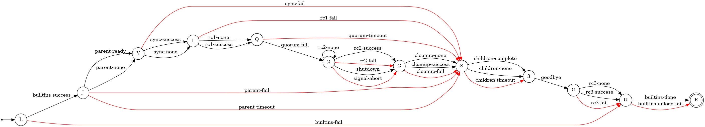
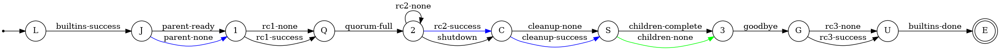

.. _broker:

######
Broker
######

The :man1:`flux-broker` provides an overlay network and a framework for
implementing distributed, message-based services.

.. note::
  This document is incomplete.  Please open an issue on
  `github <https://github.com/flux-framework/flux-core>`_
  if you have a need for broker information that is missing and we will
  do our best to answer questions and fill gaps in the documentation.

*************************
Broker Bootstrap Sequence
*************************

Each broker executes a bootstrap sequence to

1. get the size of the Flux instance
2. get its rank within the Flux instance
3. get its level within the hierarchy of Flux instances
4. get the mapping of broker ranks to nodes
5. compute the broker ranks of its peers (TBON parent and children)
6. get URI(s) of peers
7. get public key(s) of peers to initialize secure communication

An instance bootstraps using one of two mechanisms:  PMI or Config File.

PMI
===

When Flux is launched by Flux, by another resource manager, or as a
standalone test instance, PMI is used for bootstrap.

The broker PMI client uses a simple subset of PMI capabilities, abstracted for
different server implementations in the plugin-based UPMI subsystem defined
in `upmi.h <https://github.com/flux-framework/flux-core/blob/master/src/common/libpmi/upmi.h_`.  The broker PMI bootstrap sequence roughly follows the
steps outlined above.

Steps 1-4 involve accessing parameters directly provided by the PMI server.

In step 5, the fixed tree topology is used to compute the ranks of the TBON
parent and TBON children, if any.

If a broker has TBON children, it binds to a 0MQ URI that the children will
connect to.  If step 4 indicates that all brokers mapped to a single node,
the socket is bound to a local IPC path in the broker rundir.  If brokers are
mapped to multiple nodes, the socket is bound to a TCP address on the interface
hosting the default route and a randomly assigned port.  These URIs cannot
be predicted by peers, so they must be exchanged via PMI.

In addition, each broker generates a unique public, private CURVE keypair.
The public keys must be shared with peers to enable secure communication.

In step 6-7, each broker rank stores a "business card" containing its 0MQ URI
and public key to the PMI KVS under its rank.  A PMI barrier is executed.
Finally, the business cards for any peers are loaded from the PMI KVS.
The bootstrap process is complete and overlay initialization may commence.

For debugging, set :envvar:`FLUX_PMI_DEBUG=1` in the broker's environment
to get a trace of the broker's client PMI calls on stderr.  Some PMI options
may be tweaked by setting the :option:`broker.boot-method` attribute as
described in :man7:`flux-broker-attributes`.  When there are broker bootstrap
issues, sometimes it can be helpful to try to boot :man1:`flux-pmi`, a
standalone PMI client.

Flux booting Flux as a job
--------------------------

When Flux launches Flux in the job environment, Flux is providing both the
PMI server via the Flux shell *pmi* plugin, and the PMI client in the broker.

The shell *pmi* plugin offers the PMI-1 wire protocol to the broker, by
passing an open file descriptor to each broker via the :envvar:`PMI_FD`
environment variable.  The broker client uses the PMI-1 wire protocol client
to execute the bootstrap sequence.

Debugging: set the shell option :option:`verbose=2` for a server side trace
on stderr from the shell *pmi* plugin.  The shell plugin options are further
described in :man1:`flux-shell`.

booting Flux as a standalone test instance
------------------------------------------

An instance of size N may be launched on a single node using

.. code-block:: console

  flux-start --test-size=N

In this case, the PMI server is embedded in the start command, and the PMI-1
wire protocol is used as described above.

Debugging: use the :man1:`flux start` :option:`--verbose=2` option for a
server side trace on stderr.

booting Flux as a job in a foreign resource manager
---------------------------------------------------

The UPMI client used by the broker attempts to adapt to different situations
if the PMI-1 wire protocol is not available.  It tries the following in order
(unless configured otherwise):

1. simple PMI wire protocol
2. find a ``libpmi2.so`` library
3. find a ``libpmi.so`` library
4. assume singleton (rank = 0, size = 1)

Config File
===========

When Flux is launched by systemd, the brokers go through a similar bootstrap
process as under PMI, except that information is read from a set of identical
TOML configuration files replicated across the cluster.  The TOML configuration
contains a host array.

In step 1-2, the broker scans the host array for an entry with a matching
hostname.  The array index of the matching entry is the broker's rank,
and also contains its URI.  The array size is the instance size.

Steps 3-4 are satisfied by assuming that in this mode, there is one broker
per node, and the instance is at the top (level 0) of the instance hierarchy.

In step 5, as above, the tree topology is used to compute the ranks of the
TBON parent and TBON children, if any.

Instead of generating a unique CURVE keypair per broker, an instance
bootstrapped in this way shares a single CURVE keypair replicated across
the cluster.

So steps 6-7 are satisfied by simply accessing the CURVE key certificate
on disk, and looking up the peer rank indices in the hosts array.
The bootstrap process is complete and overlay initialization may commence.

********************
Broker State Machine
********************

After bootstrap, each broker comprising a Flux instance begins executing an
identical state machine.  Although there is synchronization between brokers
in some states, there is no distributed agreement on a global state for the
instance.

*Events* drive the state machine.

Entry to a new state triggers an *action*.

Actions may differ across broker ranks.  For example, entering CLEANUP state
on rank 0 launches a process and an event is generated upon process
termination, while on rank > 0, entering CLEANUP does not launch a process,
and immediately generates an event.

.. list-table::
  :header-rows: 1

  * - abbrev
    - state
    - action when transitioning into state

  * - J
    - JOIN
    - wait for parent to enter QUORUM state

  * - 1
    - INIT
    - run rc1 script

  * - B
    - QUORUM
    - wait for quorum of brokers to reach this point

  * - 2
    - RUN
    - run initial program (rank 0)

  * - C
    - CLEANUP
    - run cleanup (rank 0)

  * - S
    - SHUTDOWN
    - wait for children to finalize and exit

  * - 3
    - FINALIZE
    - run rc3 script

  * - G
    - GOODBYE
    - wait for flux-shutdown, if any

  * - E
    - EXIT
    - exit broker

Normal State Transitions
========================

It may be helpful to walk through the state transitions that occur when
a Flux instance runs to completion without encountering exceptional conditions.

green = common path; blue = rank 0 deviation from common path; red = leaf
node deviation from common path

startup
-------

The broker ranks > 0 wait for the parent to enter QUORUM state (*parent-ready*)
then enters INIT state.  Rank 0 immediately enters INIT (*parent-none*).
Upon entering INIT, the rc1 script is executed, then on completion, QUORUM
state is entered (*rc1-success*).  Because each TBON tree level waits for the
upstream level to enter QUORUM state before entering INIT state, rc1 executes
in upstream-to-downstream order.  This ensures upstream service leaders are
loaded before downstream followers.

Once a configured number of brokers have reached QUORUM state (default all),
RUN state is entered (*quorum-full*).  Rank 0 then starts the initial program.

All ranks remain in RUN state until the initial program completes.

shutdown
--------

When the initial program completes, rank 0 transitions to CLEANUP state
(*rc2-success*) and runs any cleanup script(s).  Cleanups execute while the
other broker ranks remain in RUN state.  Upon completion of cleanups, rank 0
enters SHUTDOWN state (*cleanup-success*).

The broker ranks > 0 monitor parent state transitions.  The parent
transitioning to SHUTDOWN causes a transition from RUN to CLEANUP
(*shutdown*).  They immediately transition through CLEANUP (*cleanup-none*)
to SHUTDOWN state.

All brokers with children remain in SHUTDOWN until their children disconnect
(*children-complete*).  If they have no children (leaf node), they transition
out of SHUTDOWN immediately (*children-none*). The next state is FINALIZE,
where the rc3 script is executed.  Upon completion of rc3 (*rc3-success*),
brokers transition to EXIT and disconnect from the parent.

Because each TBON tree level waits for the downstream level to disconnect
before entering FINALIZE state, rc3 executes in downstream-to-upstream order.
This ensures downstream service followers are unloaded before upstream leaders.

The rank 0 broker is the last to exit.

variation: no rc2 script (initial program)
------------------------------------------

A system instance does not define an initial program.  Brokers transition to
RUN state as above, and remain there until the *shutdown* event is
posted.  That may occur if:
- the broker receives a signal
- the broker's TBON parent enters SHUTDOWN state
- (rank 0 only) :man1:`flux-shutdown` requests instance shutdown

variation: no rc1, rc3, or cleanup scripts
------------------------------------------

In test sometimes we eliminate the rc1, cleanup, and/or rc3 scripts to simplify
or speed up a test environment.  In these cases, entry into INIT, CLEANUP,
and FINALIZE states generates a *rc1-none*, *cleanup-none*, or *rc3-none*
event, which causes an immediate transition to the next state.

Events
======

.. list-table::
  :header-rows: 1

  * - event
    - description

  * - parent-ready
    - parent has entered BARRIER state

  * - parent-none
    - this broker has no parent

  * - parent-fail
    - parent has ended communication with this broker

  * - parent-timeout
    - parent has not responded within timeout period

  * - rc1-none
    - rc1 script is defined on this broker

  * - rc1-success
    - rc1 script completed successfully

  * - rc1-fail
    - rc1 script completed with errors

  * - quorum-full
    - configured quorum of brokers reached

  * - quorum-timeout
    - configured quorum not reached within timeout period

  * - rc2-none
    - no rc2 script (initial program) is defined on this broker

  * - rc2-success
    - rc2 script completed successfully

  * - rc2-fail
    - rc2 script completed with errors

  * - shutdown
    - broker received an external cue to begin shutting down

  * - signal-abort
    - broker received terminating signal

  * - cleanup-none
    - no cleanup script is defined on this broker

  * - cleanup-success
    - cleanup script completed successfully

  * - cleanup-fail
    - cleanup script completed with errors

  * - children-complete
    - all children have disconnected from this broker

  * - children-none
    - this broker has no children

  * - children-timeout
    - children did not disconnected within timeout period

  * - rc3-none
    - no rc3 script is defined on this broker

  * - rc3-success
    - rc3 script completed successfully

  * - rc3-fail
    - rc3 script completed with errors

  * - goodbye
    - any flux-shutdown commands have completed

**************************
System Instance Resiliency
**************************

The Flux system instance has to deal with the usual challenges faced by cluster
system software, such as node crashes and network outages.  Although Flux's
design attempts to meet these challenges with minimal human intervention and
lost work, there are caveats that need to be understood by Flux developers.
This page describes Flux's current design for resiliency.

NOTE: some of this is aspirational at the time of this writing, for our L2
resiliency planning goal to be demonstrated in early 2022.

Disordered bring-up
===================

The broker state machine ensures that a starting broker pauses until its TBON
parent completes the rc1 script before starting its own rc1 script, so that
upstream services are online before downstream ones start.  As a result, it
is feasible to configure Flux to start automatically, then power on the entire
cluster at once and let Flux sort itself out.

If some nodes take longer to start up, or don't start at all, then those nodes
and their TBON children, if any, will remain offline until they do start.
The TBON has a fixed topology determined by configuration, and brokers do not
adapt to route around down nodes.  In addition, Flux must be completely stopped
to alter the topology configuration - it cannot be changed on the fly.

See the `Flux Administrator's Guide <https://flux-framework.readthedocs.io/projects/flux-core/en/latest/guide/admin.html>`_
for a discussion on draining nodes and excluding nodes from scheduling via
configuration.  Scheduling is somewhat orthogonal to this topic.

Subtree shut down
=================

Flux is stopped administratively with `systemctl stop flux`.  This is may
be run on any broker, and will affect the broker's TBON subtree.  If run on
the rank 0 broker, the entire Flux instance is shut down.

Upon receiving SIGTERM from systemd, the broker informs its TBON children that
it is shutting down, and waits for them to complete rc3 in leaves-to-root
order, thus ensuring that the instance captures any state held on those
brokers, such as KVS content.

A broker that is cleanly shut down withdraws itself as a peer from its TBON
parent.  Future RPCs to the down broker automatically receive an EHOSTUNREACH
error response.

Node crash
==========

If a node crashes without shutting down its flux broker, state held by that
broker and its TBON subtree is lost if it was not saved to its TBON parent.

The TBON parent of the lost node detects that its child has stopped sending
messages.  The parent marks the child lost and future RPCs directed to
(or through) the crashed node receive an EHOSTUNREACH error response.  In
addition, RPCs are tracked at the broker overlay level, and any requests that
were directed to (or through) the lost node that are unterminated, as
defined by :doc:`RFC 6 <rfc:spec_6>` receive an EHOSTUNREACH error response.

The TBON children of the lost node similarly detect the lack of parent
messages.  The child marks the parent offline and future RPCs, as well as
existing unterminated RPCs to that node receive an EHOSTUNREACH error response.
These nodes then proceed as though they were shut down, however since they are
cut off from upstream, any RPCs executed in rc3 to save state will fail
immediately.  Effectively a *subtree panic* results and data may be lost.

Node returning to Service
=========================

When a lost node comes back up, or when an administratively shut down node
is restarted with

.. code-block:: console

  systemctl start flux

the freshly started broker attempts to join the instance via its TBON parent,
just as if it were joining for the first time, and carrying no state from
the previous incarnation.

The broker peer is identified for response routing purposes by its UUID, which
changes upon restart.  In-flight responses directed to (or through) the
old UUID are dropped.  This is desirable behavior because matchtags from the
previous broker incarnation(s) might become confused with matchtags from the
current one, and the old responses are answering requests that the current
broker didn't send.

:linux:man1:`systemd` is configured to aggressively restart brokers that stop
on their own, so TBON children of the returning broker should also be
attempting to join the instance and may do so once the returning broker has
completed the rc1 script.

Network outage
==============

Network outages that persist long enough are promoted to hard failures.

Case 1:  A TBON parent marks its child lost due to a temporary network
interruption, and the child has not yet marked the parent lost when
communication is restored.  In this case, the parent sees messages from the
lost UUID, and sends a kiss of death message to the child, causing a subtree
panic at the child.  The subtree restarts and rejoins the instance.

Case 2:  The TBON child marks its parent lost due to a temporary network
interruption, and the parent has not yet marked the child lost when
communication is restored.  Assuming the child subtree has restarted,
the child introduces itself to the parent with a new UUID.  Before allowing
the child to join, it marks the old UUID lost and fails unterminated RPCs
as described above.  It then accepts the child's introduction and allows
the subtree to join.

Diagnostic: subtree health check
================================

Each broker maintains a subtree health state that depends on the health
state reported by its TBON children.  The states are as follows:

.. list-table::
  :header-rows: 1

  * - name
    - description

  * - full
    - online and no children partial/offline/degraded/lost

  * - partial
    - online, some children partial/offline; no children degraded/lost

  * - degraded
    - online, some children degraded/lost

  * - lost
    - gone missing (according to parent)

  * - offline
    - not yet seen, or cleanly shut down (according to parent)

A user may quickly assess the overall health of the overlay network by
requesting the subtree health at rank 0.  If the state is reported as
*partial* or *degraded*, then the TBON may be probed further for details
using the following algorithm:

1. Request state of TBON children from target rank
2. List TBON children in *lost* or *offline* state
3. For each child in *partial* or *degraded* state, apply this algorithm
   on child rank
