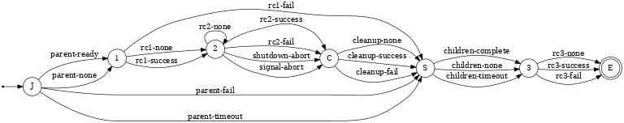
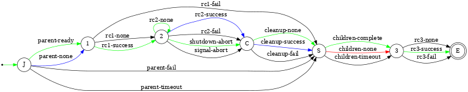

## Broker State Machine

After bootstrap, each broker comprising a Flux instance begins executing an
identical state machine.  Although there is synchronization between brokers
in some states, there is no distributed agreement on a global state for the
instance.

_Events_ drive the state machine.

Entry to a new state triggers an _action_.

Actions may differ across broker ranks.  For example, entering CLEANUP state
on rank 0 launches a process and an event is generated upon process termination,
while on rank > 0, entering CLEANUP does not launch a process, and immediately
generates an event.

#### States

**abbrev**	| **state**	| **action when transitioning into state**
:--		| :--		| :--
J		| JOIN		| wait for parent to enter QUORUM state
1		| INIT		| run rc1 script
B		| QUORUM	| wait for quorum of brokers to reach this point
2		| RUN		| run initial program (rank 0)
C		| CLEANUP	| run cleanup (rank 0)
S		| SHUTDOWN	| wait for children to finalize and exit
3		| FINALIZE	| run rc3 script
G		| GOODBYE       | wait for flux-shutdown, if any
E		| EXIT		| exit broker

### Normal State Transitions

It may be helpful to walk through the state transitions that occur when
a Flux instance runs to completion without encountering exceptional conditions.

green = common path; blue = rank 0 deviation from common path; red = leaf node deviation from common path

#### startup

The broker ranks > 0 wait for the parent to enter QUORUM state (_parent-ready_)
then enters INIT state.  Rank 0 immediately enters INIT (_parent-none_).
Upon enering INIT, the rc1 script is executed, then on completion, QUORUM
state is entered (_rc1-success_).  Because each TBON tree level waits for the
upstream level to enter QUORUM state before entering INIT state, rc1 executes
in upstream-to-downstream order.  This ensures upstream service leaders are
loaded before downstream followers.

Once a configured set of brokers have reached QUORUM state (default all),
RUN state is entered (_quorum-full_).  Rank 0 then starts the initial program.

All ranks remain in RUN state until the initial program completes.

#### shutdown

When the initial program completes, rank 0 transitions to CLEANUP state
(_rc2-success_) and runs any cleanup script(s).  Cleanups execute while the
other broker ranks remain in RUN state.  Upon completion of cleanups, rank 0
enters SHUTDOWN state (_cleanup-success_).

The broker ranks > 0 monitor parent state transitions.  The parent
transitioning to SHUTDOWN causes a transition from RUN to CLEANUP
(_shutdown-abort_).  They transition through CLEANUP (_cleanup-none_)
to SHUTDOWN state.

All brokers with children remain in SHUTDOWN until their children disconnect
(_children-complete_).  If they have no children (leaf node), they transition
out of SHUTDOWN immediately (_children-none_). The next state is FINALIZE,
where the rc3 script is executed.  Upon completion of rc3 (_rc3-success_),
brokers transition to EXIT and disconnect from the parent.

Because each TBON tree level waits for the downstream level to disconnect
before entering FINALIZE state, rc3 executes in downstream-to-upstream order.
This ensures downstream service followers are unloaded before upstream leaders.

The rank 0 broker is the last to exit.

#### variation: no rc2 script (initial program)

A system instance does not define an initial program.  Brokers transition to
RUN state as above, and remain there until the _shutdown-abort_ event is
posted.  That may occur if:
- the broker receives a signal
- the broker's TBON parent enters SHUTDOWN state
- (rank 0 only) `flux-shutdown` requests instance shutdown

#### variation: no rc1, rc3, or cleanup scripts

In test sometimes we eliminate the rc1, cleanup, and/or rc3 scripts to simplify
or speed up a test environment.  In these cases, entry into INIT, CLEANUP,
and FINALIZE states generates a _rc1-none_, _cleanup-none_, or _rc3-none_ event,
which causes an immediate transition to the next state.

### Events

**event**	| **description**
:--		| :--
_parent-ready_	| parent has entered BARRIER state
_parent-none_	| this broker has no parent
_parent-fail_	| parent has ended communication with this broker
_parent-timeout_ | parent has not responded within timeout period
_rc1-none_	| rc1 script is defined on this broker
_rc1-success_	| rc1 script completed successfully
_rc1-fail_	| rc1 script completed with errors
_quorum-full_	| configured quorum of brokers reached
_quorum-timeout_ | configured quorum not reached within timeout period
_rc2-none_	| no rc2 script (initial program) is defined on this broker
_rc2-success_	| rc2 script completed successfully
_rc2-fail_	| rc2 script completed with errors
_shutdown-abort_ | broker received shutdown event
_signal-abort_	| broker received terminating signal
_cleanup-none_	| no cleanup script is defined on this broker
_cleanup-success_ | cleanup script completed successfully
_cleanup-fail_	| cleanup script completed with errors
_children-complete_ | all children have disconnected from this broker
_children-none_ | this broker has no children
_children-timeout_ | children did not disconnected within timeout period
_rc3-none_	| no rc3 script is defined on this broker
_rc3-success_	| rc3 script completed successfully
_rc3-fail_	| rc3 script completed with errors
_goodbye_	| any flux-shutdown commands have completed

